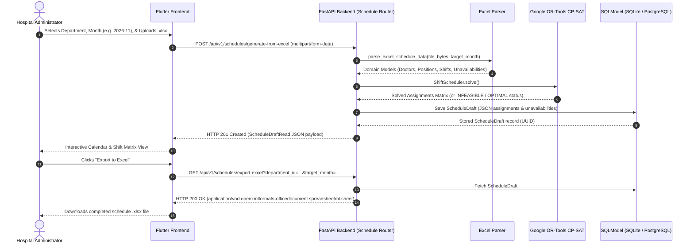

# Excel-Based Schedule Generation Workflow

## 1. Overview & Purpose

The **Excel-Based Schedule Generation** workflow is a zero-friction, MVP scheduling solution for the Schedule-Maker platform. 

### Why this workflow exists
1. **Immediate Onboarding (MVP)**: Clinical departments frequently do not have the time or administrative resources to onboard all individual physicians, accounts, positions, and complex shift rules into the database before generating their next monthly roster.
2. **Offline Administration**: Works seamlessly with single-file SQLite databases for desktop administrators who coordinate schedules locally without requiring internet connectivity or cloud server access.
3. **Decoupled Architecture**: Solves constraints directly from uploaded spreadsheet data without requiring pre-existing database records in the `doctor` or `shift` tables.

---

## 2. Spreadsheet Specification & Contract

The uploaded Excel workbook (`.xlsx`) must adhere to the two-sheet contract detailed below.

### Sheet 1: `Doctors` (Required)
Defines the clinical roster, roles, unavailabilities, and fixed pre-assignments.

| Column Header | Type | Required | Description / Example |
| :--- | :--- | :--- | :--- |
| **`Name`** | String | Yes | Full name of the doctor (e.g. `Dr. Gregory House`). |
| **`Email`** | String | Yes | Doctor email or unique identifier (e.g. `house@hospital.org`). |
| **`Position`** | String | Yes | Clinical position or specialty role (e.g. `ER`, `ICU`, `Attending`). Multi-position doctors can specify comma-separated positions (e.g. `ER, ICU`). |
| **`Team`** | String | No | Team tag to balance weekend duties across teams (e.g. `Team Alpha`). |
| **`Unavailability`** | String | No | Days the doctor cannot work. Supports comma-separated days (`3, 14, 22`), ranges (`3-7, 15-18`), or ISO dates (`2026-11-03, 2026-11-14`). |
| **`Pre-Assignments`** | String | No | Locked-in assignments in `Day:Shift` or `Date:Shift` format (e.g. `5:Morning, 12:Night`). |
| **`Max Duties`** | Integer | No | Custom duty cap override for this doctor (defaults to department configuration, e.g. 7 or 8 duties). |

### Sheet 2: `Positions & Shifts` (Optional)
Defines operational shift requirements per position. If this sheet is omitted, the parser defaults to requiring **1 doctor per calendar day** for every distinct position present in Sheet 1.

| Column Header | Type | Required | Description / Example |
| :--- | :--- | :--- | :--- |
| **`Position`** | String | Yes | Name of the position matching Sheet 1 (e.g. `ER`). |
| **`Shift Name`** | String | Yes | Name of the shift (e.g. `Morning`, `Night`, `24h Duty`). |
| **`Doctors Per Shift`** | Integer | No | Required staffing count per shift (default: `1`). |
| **`Duty Days`** | String | No | Operational days of week (`0,1,2,3,4,5,6` or `Mon-Sun`). |
| **`Grants Day Off`** | Boolean/String | No | Enforces a mandatory rest day after duty (`Yes`/`No` or `TRUE`/`FALSE`). |

---

## 3. End-to-End System Workflow

### Detailed Lifecycle Steps

1. **Upload & Multi-Tenant Authorization**:
   - The admin selects their department and target month (`YYYY-MM`) in the Flutter UI.
   - The user's role and tenant boundary are validated via `_resolve_and_verify_department`.
2. **Parsing & Range Normalization**:
   - The uploaded byte buffer is read into memory without saving temporary files to disk.
   - Days and ranges are parsed into zero-based calendar day indices.
   - Flexible shift matching strips whitespace and ignores case.
3. **CP-SAT Constraint Optimization**:
   - Hard constraints enforced:
     - Shift coverage requirements.
     - Doctor unavailabilities (blocked days).
     - Strict pre-assignments.
     - Daily max 1 shift per doctor.
     - Post-duty mandatory rest days (`grants_day_off`).
   - Soft constraints optimized:
     - Equal total duty distribution across doctors.
     - Weekend shift distribution balance.
     - Minimizing back-to-back shifts (every-other-day penalty).
4. **Staging Persistence in `ScheduleDraft`**:
   - Rather than inserting unlinked text into relational `ShiftAssignment` rows, the solved schedule is saved to the `schedule_draft` table:
     - `department_id`: Scoped to current department.
     - `target_month`: String in format `YYYY-MM`.
     - `solver_status`: `"OPTIMAL"` or `"FEASIBLE"`.
     - `status`: Staged as `"draft"`.
     - `assignments`: Serialized list of assigned items stored in a database `JSON` column.
     - `unavailabilities`: Mapping of `{doctor_name: [unavailable_days]}` stored in a database `JSON` column.
5. **Interactive UI View**:
   - The Flutter frontend receives the `ScheduleDraftRead` response and displays a monthly grid with doctors, assigned duties, and weekends.
6. **Formatted Excel Export**:
   - Admin downloads the final schedule via `GET /api/v1/schedules/export-excel`.
   - The exported workbook contains:
     - Header row with all calendar day numbers (1 to 28/30/31).
     - Weekend column highlighting (light gray `#F2F2F2`).
     - Doctor unavailability cells blacked out (`#000000`) with white bold `"X"`.
     - Assigned shift abbreviations (e.g. `"M"`, `"N"`).
     - Total duties summary column.

---

## 4. API Endpoints Reference

### 1. Generate Schedule from Excel
- **Endpoint**: `POST /api/v1/schedules/generate-from-excel`
- **Content-Type**: `multipart/form-data`
- **Form Fields**:
  - `file`: Uploaded `.xlsx` binary file.
  - `target_month`: Target month in `YYYY-MM` format (e.g. `2026-11`).
  - `department_id` (Optional for Department Admins; Required for Super Admins).
- **Responses**:
  - `201 Created`: Returns `ScheduleDraftRead`.
  - `400 Bad Request`: Invalid file extension or corrupt workbook.
  - `404 Not Found`: Department not found.
  - `422 Unprocessable Entity`: Month format invalid or solver infeasible.

### 2. Retrieve Stored Schedule Draft
- **Endpoint**: `GET /api/v1/schedules/draft`
- **Query Parameters**:
  - `target_month` (`str`, required, format `YYYY-MM`).
  - `department_id` (`UUID`, optional for Department Admins).
- **Responses**:
  - `200 OK`: Returns existing `ScheduleDraftRead`.
  - `404 Not Found`: No draft found for this department and month.

### 3. Export Formatted Excel Schedule
- **Endpoint**: `GET /api/v1/schedules/export-excel`
- **Query Parameters**:
  - `target_month` (`str`, required, format `YYYY-MM`).
  - `department_id` (`UUID`, optional for Department Admins).
- **Responses**:
  - `200 OK`: Binary stream (`application/vnd.openxmlformats-officedocument.spreadsheetml.sheet`) with `Content-Disposition: attachment; filename="schedule_<month>.xlsx"`.
  - `404 Not Found`: No draft exists to export.

---

## 5. Relationship Between Draft and Final Schedules

| Feature / Aspect | `ScheduleDraft` (Staging Area) | `ShiftAssignment` (Live Production) |
| :--- | :--- | :--- |
| **Model** | `src.schedule.models.ScheduleDraft` | `src.shift.models.ShiftAssignment` |
| **Storage Strategy** | Denormalized JSON matrix & metadata | Relational table (`doctor_id`, `shift_id`, `date`) |
| **Foreign Keys** | Only `department_id` (no doctor FKs) | Foreign keys to `doctor.id` and `shift.id` |
| **Primary Audience** | Administrator previewing solver output | Doctors checking active shifts on calendars |
| **Workflow State** | Staging / editable working canvas | Official, published operational schedule |
| **Excel MVP Role** | Holds Excel-generated schedules directly | Bypassed in Excel MVP; used when onboarding to DB |
